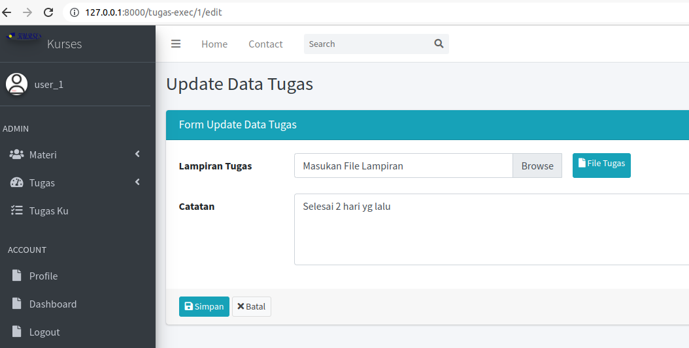
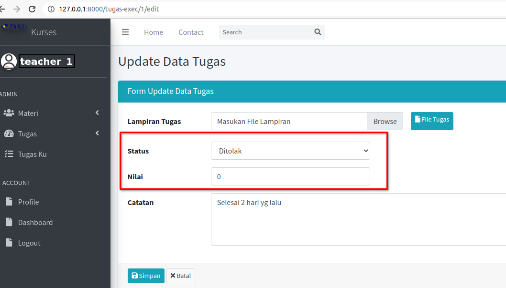

## Project : Kurses

Sebuah aplikasi DB utk menyimpan Materi dan Tugas dari Guru/Pemberi Materi kepada Murid.
### Lebih Detail:
- Started: May-2022
- Dibuat menggunakan PHP Framework: Laravel.
- Menggunakan DB-MySQL.
- Admin template: AdminLTE3
- FrontEnd template: EduStage dari ColorLib
- Login/Logout MultiUser (Admin, Guru, Murid)
- dll..

## Project : Snapshot

