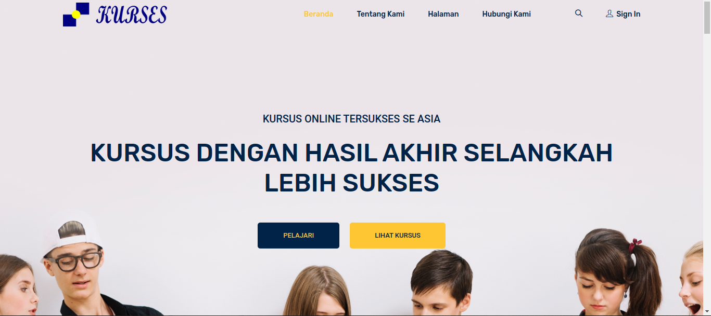
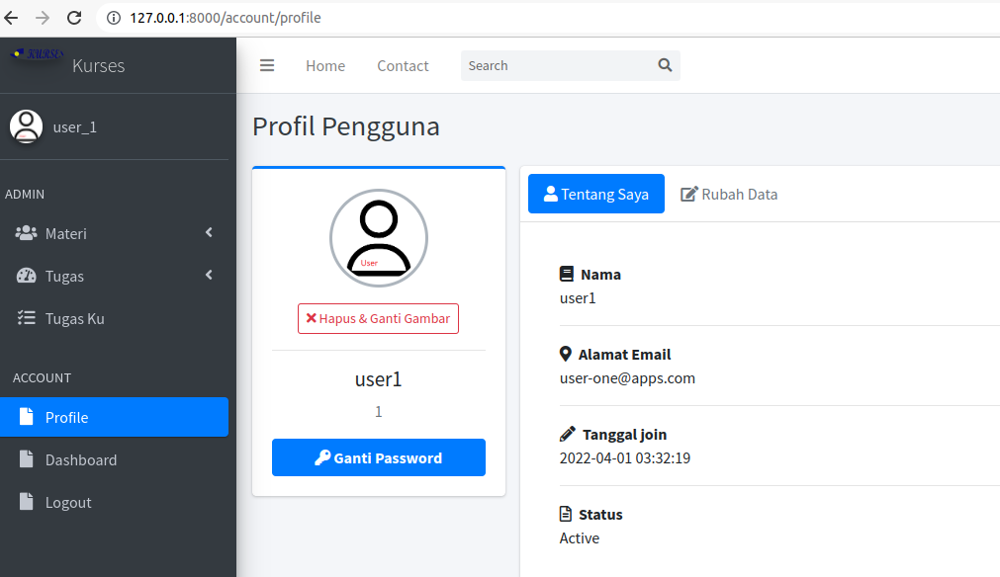

## Nama Projek : Kurses 

Sebuah aplikasi Web Apps utk menyimpan Materi dan Tugas dari hasil pembelajaran antara Guru sbg Pemberi Materi dan Murid sbg Penerima Materi. 
Selanjutnya Guru memberikan Tugas kepada Murid, Tugas dikumpulkan dalam bentuk File dan akan ada koreksi jika Tugas tsb sudah diupload/selesai dikerjakan.

### Lebih Detail:
- Dimulai: Pertengahan Apr-2022
- Dibuat menggunakan PHP Framework: Laravel versi 9.
- Menggunakan DB-MySQL (root/database/kurses-db-utf8.sql).
- Admin template: AdminLTE3.
- FrontEnd template: EduStage dari ColorLib.
- Login/Logout/Daftar Pengguna (MultiUser -- Admin, Guru, Murid)
- Menambahkan Materi Belajar dan Tugas Otorisasi oleh Guru ato Admin
- Murid, hanya bisa akses Materi Belajar dan Tugas saja.
- Guru, bisa melihat Tugas mana yang sudah/belum di kerjakan oleh Muridnya.
- Guru, bisa memberikan nilai dari Tugas yg sudah dikerjakan oleh Muridnya.
- User sbg admin, gunakan: admin // pass123
- User sbg guru, gunakan: spv_1 // pass123
- User sbg murid, gunakan: user_1 // pass123, atau: staff_1 // pass123
- dll.

## Snapshots:

